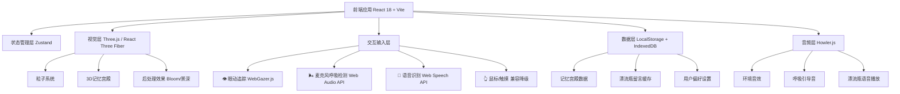
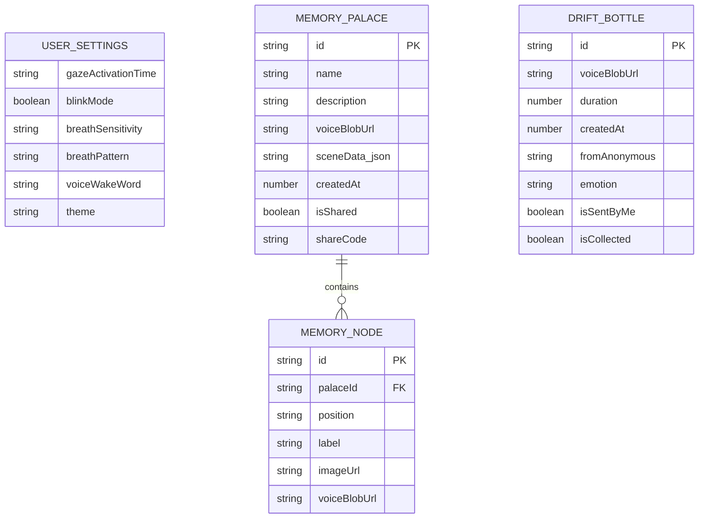

## 1. 架构设计



## 2. 技术描述

- **前端框架**：React 18 + TypeScript
- **构建工具**：Vite 5（极速热更新，开发体验流畅）
- **样式方案**：TailwindCSS 3 + 自定义 CSS Variables（主题色系统）
- **3D渲染引擎**：Three.js + @react-three/fiber + @react-three/drei + @react-three/postprocessing
- **状态管理**：Zustand（轻量、简洁、支持持久化中间件）
- **路由方案**：React Router v6（SPA多页面切换，支持动画过渡）
- **后端服务**：无后端纯前端架构（LocalStorage/IndexedDB本地存储，漂流瓶功能使用模拟数据演示，可后续扩展为Supabase/Firebase）
- **数据库**：IndexedDB（通过localForage封装），用于存储记忆宫殿3D场景数据、语音留言Blob

### 核心技术库选择理由

| 技术 | 用途 | 选择理由 |
|------|------|---------|
| WebGazer.js | 浏览器内眼动追踪 | 纯前端、无需硬件、开源免费，支持摄像头实现基础眼动/凝视检测 |
| Web Audio API | 呼吸检测 | 分析麦克风输入音量/频率变化，检测吸气呼气节奏 |
| Web Speech API | 语音识别 | 浏览器原生支持，无需后端，实现语音转文字和语音合成播报 |
| @react-three/fiber | 3D场景 | React声明式写法管理Three.js，与应用状态无缝集成 |
| localForage | 本地存储 | IndexedDB友好封装，支持存储Blob音频和大型JSON数据 |
| Howler.js | 音频管理 | Web Audio API封装，支持多音效同时播放、淡入淡出、空间音效 |
| framer-motion | UI动画 | 声明式React动画，实现页面过渡、悬浮效果、凝视反馈等 |

## 3. 路由定义

| 路由路径 | 页面名称 | 功能说明 |
|---------|---------|---------|
| `/` | 灵境入口首页 | 四大功能导航、设备状态检测、沉浸式背景 |
| `/eye-explore` | 眼动漫游世界 | 凝视交互冒险游戏，多场景漫游 |
| `/breath-puzzle` | 呼吸解谜空间 | 呼吸控制风力、船只、冥想引导 |
| `/memory-palace` | 记忆宫殿大厅 | 宫殿列表、创建入口、分享管理 |
| `/memory-palace/:id` | 记忆宫殿漫游 | 3D场景漫游、回忆节点交互 |
| `/drift-bottle` | 病友漂流瓶 | 海面、发送/拾取瓶子、我的海滩 |
| `/settings` | 无障碍设置 | 眼动灵敏度、呼吸校准、语音设置 |

## 4. API 定义（前端模拟层）

使用前端 Mock Service Worker 模拟API，后续可无缝替换为真实后端。

```typescript
// 漂流瓶数据类型
interface DriftBottle {
  id: string;
  voiceBlobUrl: string;      // 本地音频Blob URL
  duration: number;           // 音频时长（秒）
  createdAt: number;          // 创建时间戳
  fromAnonymous: string;      // 匿名昵称（如"来自海边的朋友"）
  emotion?: 'warm' | 'miss' | 'encourage' | 'peaceful';
}

// 记忆宫殿数据类型
interface MemoryPalace {
  id: string;
  name: string;               // 宫殿名称，如"童年的院子"
  description: string;        // 语音转写的描述文本
  voiceBlobUrl: string;       // 原始语音录音
  sceneData: MemoryScene;     // 3D场景配置数据
  createdAt: number;
  isShared: boolean;
  shareCode?: string;         // 分享邀请码
}

interface MemoryScene {
  type: 'indoor' | 'outdoor' | 'mixed';
  lighting: 'sunrise' | 'sunset' | 'noon' | 'night';
  memoryNodes: MemoryNode[];
}

interface MemoryNode {
  id: string;
  position: [number, number, number];
  label: string;
  imageUrl?: string;
  voiceBlobUrl?: string;
}

// 用户设置类型
interface UserSettings {
  gazeActivationTime: number;    // 凝视激活时间 0.8~3秒
  blinkMode: boolean;            // 是否启用眨眼确认
  breathSensitivity: 'low' | 'medium' | 'high';
  breathPattern: '4-7-8' | 'natural' | 'custom';
  voiceWakeWord: string;
  theme: 'aurora' | 'starry' | 'ocean';
}

// Mock API 接口
interface MockAPI {
  getRandomBottle: () => Promise<DriftBottle>;
  sendBottle: (voiceBlob: Blob, duration: number) => Promise<void>;
  getMyBottles: () => Promise<DriftBottle[]>;
  createMemoryPalace: (data: Omit<MemoryPalace, 'id' | 'createdAt'>) => Promise<MemoryPalace>;
  listMemoryPalaces: () => Promise<MemoryPalace[]>;
  getUserSettings: () => Promise<UserSettings>;
  updateUserSettings: (patch: Partial<UserSettings>) => Promise<UserSettings>;
}
```

## 5. 数据模型（本地存储）



## 6. 前端组件架构设计

```
src/
├── components/
│   ├── common/              # 通用组件
│   │   ├── GazeButton.tsx          # 凝视激活按钮（核心交互组件）
│   │   ├── GlowOrb.tsx             # 发光光球（通用视觉元素）
│   │   ├── ParticleField.tsx       # 粒子背景
│   │   ├── AuroraBackground.tsx    # 极光渐变背景
│   │   └── VoiceRecorder.tsx       # 语音录制组件
│   ├── layout/              # 布局组件
│   │   ├── PageTransition.tsx      # 页面过渡动画
│   │   └── StatusIndicators.tsx    # 设备状态指示器
│   ├── eye-explore/         # 眼动漫游模块
│   │   ├── ExploreScene.tsx        # 漫游场景容器
│   │   ├── PlayerLight.tsx         # 玩家光团化身
│   │   └── MemoryShard.tsx         # 可收集的记忆碎片
│   ├── breath-puzzle/       # 呼吸解谜模块
│   │   ├── BreathGuideOrb.tsx      # 呼吸引导光球
│   │   ├── WindmillScene.tsx       # 风车场景
│   │   └── BoatSailingScene.tsx    # 船只航行场景
│   ├── memory-palace/       # 记忆宫殿模块
│   │   ├── PalaceCard.tsx          # 宫殿列表卡片
│   │   ├── PalaceCreator.tsx       # 语音创建宫殿入口
│   │   └── Palace3DScene.tsx       # 3D漫游场景
│   └── drift-bottle/        # 漂流瓶模块
│       ├── OceanSurface.tsx        # 海面场景
│       ├── Bottle.tsx              # 漂流瓶实体
│       └── BeachCollection.tsx     # 我的海滩收藏
├── hooks/
│   ├── useGazeTracker.ts           # 凝视检测Hook
│   ├── useBreathDetector.ts        # 呼吸检测Hook
│   ├── useVoiceRecognition.ts      # 语音识别Hook
│   └── useAudioAmbient.ts          # 环境音效Hook
├── stores/
│   ├── userSettingsStore.ts        # 用户设置状态
│   └── appStateStore.ts            # 全局应用状态
├── utils/
│   ├── mockApi.ts                  # 模拟API层
│   ├── storage.ts                  # 本地存储封装
│   └── sceneGenerators.ts          # 3D场景生成器（AI模拟）
├── pages/                          # 路由页面组件
├── App.tsx
├── main.tsx
└── index.css
```

## 7. 无障碍交互核心实现方案

### 7.1 凝视检测（useGazeTracker Hook）
- 基于 WebGazer.js 实时获取瞳孔坐标
- 内部维护"当前注视元素"状态，使用 DOM 元素 `elementFromPoint` 判定
- 对可交互元素（GazeButton）绑定 `data-gaze="true"` 属性
- 计时逻辑：连续注视达到 `gazeActivationTime` 毫秒触发 `onGazeActivate`
- 凝视进度圆环通过 CSS `conic-gradient` 实时渲染

### 7.2 呼吸检测（useBreathDetector Hook）
- 通过 `getUserMedia` 获取麦克风权限
- 使用 `AnalyserNode` 获取时域波形数据
- 计算 RMS（均方根）音量，使用滑动窗口平滑
- 检测音量上升沿=吸气，下降沿=呼气
- 维持呼吸状态机：idle → inhaling → holding → exhaling → idle
- 对外暴露 `breathState`、`breathIntensity`（0~1）等响应式状态

### 7.3 语音识别（useVoiceRecognition Hook）
- 封装 `webkitSpeechRecognition`，提供连续识别与单次识别模式
- 唤醒词检测：实时匹配"小灵小灵"触发全局命令模式
- 命令解析：简单正则匹配"打开/返回/发送"等指令
- 语音合成：使用 `speechSynthesis` 提供温和女声反馈
