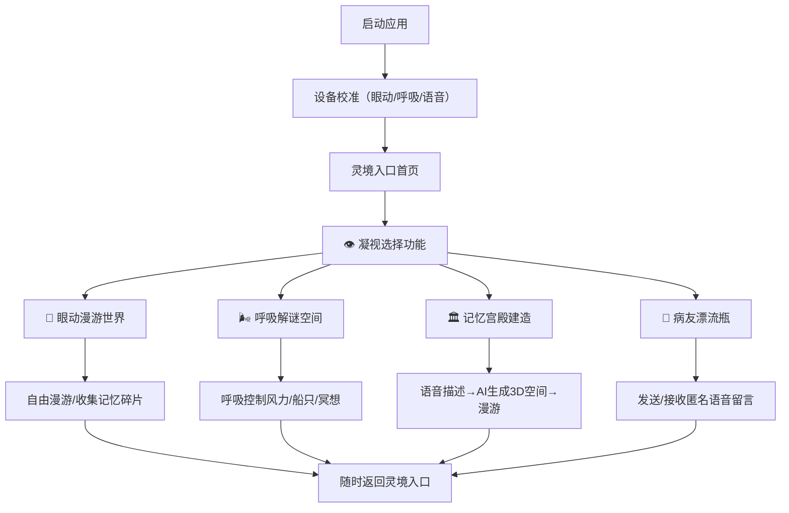

## 1. 产品概述

「灵境漫游」是一款专为肌萎缩侧索硬化症（ALS）早期及中期患者设计的互动式精神陪伴游戏。患者虽逐渐失去行动能力，但认知完好、情感丰富，极度渴望精神世界的出口与连接。本应用通过眼动追踪、呼吸感知、语音交互等多模态无障碍输入方式，为渐冻症患者构建一个不受肉体束缚的自由精神世界。

产品核心价值：让被困于躯壳中的灵魂，获得漫游、创造、连接的自由。

## 2. 核心功能

### 2.1 用户角色

| 角色 | 注册方式 | 核心权限 |
|------|---------|---------|
| 患者用户 | 手机号/家属协助注册 | 完整使用全部四大功能模块 |
| 家属访客 | 邀请码链接访问 | 浏览患者分享的记忆宫殿、接收留言 |

### 2.2 功能模块

1. **首页（灵境入口）**：功能导航、个性化欢迎、当前状态提示
2. **眼动漫游世界**：基于凝视交互的点击冒险游戏，玩家扮演"幽灵探险家"
3. **呼吸解谜空间**：利用麦克风检测呼吸节奏，控制风力、航行等机制
4. **记忆宫殿建造**：语音描述人生场景，AI生成可漫游的3D记忆空间
5. **病友漂流瓶**：匿名语音留言，低门槛精神互助网络

### 2.3 页面详情

| 页面名称 | 模块名称 | 功能描述 |
|---------|---------|---------|
| 首页 | 灵境入口 | 沉浸式星空/极光背景，四大功能以"意识之门"形式呈现，凝视选择 |
| 首页 | 状态感知层 | 自动检测眼动/呼吸/语音设备状态，无障碍引导 |
| 眼动漫游 | 场景漫游 | 多个梦幻场景（星海、森林、云端），凝视触发交互元素 |
| 眼动漫游 | 幽灵探险家 | 玩家以光团形态存在，凝视移动，收集记忆碎片解锁剧情 |
| 呼吸解谜 | 风力世界 | 深呼吸控制风车转动、蒲公英飘散，缓慢呼气推动船只航行 |
| 呼吸解谜 | 节奏冥想 | 呼吸引导式视觉反馈，配合舒缓音效，兼具疗愈效果 |
| 记忆宫殿 | 语音创建 | 长按语音键描述场景（童年老宅、海边旅行…），AI实时生成3D空间 |
| 记忆宫殿 | 漫游回味 | 第一人称漫游记忆空间，凝视触发细节回忆（照片、物品浮现） |
| 记忆宫殿 | 分享展示 | 生成邀请链接，家属可VR/3D方式参观患者的记忆宫殿 |
| 漂流瓶 | 扔出瓶子 | 录制语音留言，随机发送给一位病友 |
| 漂流瓶 | 拾取瓶子 | 海面随机漂来瓶子，凝视打开，收听匿名留言 |
| 漂流瓶 | 我的海滩 | 收藏的温暖留言以发光贝壳形式陈列 |

## 3. 核心流程

患者启动应用后，首先进入灵境入口首页。系统自动校准眼动追踪（或提示眨眼模式），患者通过凝视选择四大功能之一。每个模块均可通过凝视/呼吸/语音完成全部操作，全程无需肢体接触。

核心使用流程：设备校准 → 凝视选择功能模块 → 沉浸式体验 → 随时切换/返回。

## 4. 用户界面设计

### 4.1 设计风格

**整体美学方向：空灵治愈·超现实梦幻**

- **主色调**：深邃午夜蓝 `#0a0e27` 为底色，流动极光紫 `#7c3aed` 与薄荷青绿 `#5eead4` 为流动光晕，温暖星光金 `#fbbf24` 点缀交互元素
- **辅助色**：柔和肉粉 `#fda4af` 用于呼吸引导，深海青蓝 `#0ea5e9` 用于水体元素
- **按钮风格**：无实体感的"意识光点"——半透明发光圆形，凝视时产生涟漪扩散效果，确认时产生温柔的爆发光效
- **字体选择**：标题使用「霞鹜文楷」或「思源宋体」（具有人文温度的衬线字体），正文使用「HarmonyOS Sans」（清晰易读的无衬线字体）
- **字体大小**：核心交互文字不小于 24px，标题 48-72px，确保眼动识别精准
- **布局风格**：极度留白，以宇宙/海洋/梦境为空间隐喻，元素漂浮分布，无传统边框和卡片
- **视觉隐喻**：所有UI元素均以自然意象呈现——按钮是漂浮的萤火虫、菜单是星座连线、进度条是流动的星河
- **图标风格**：极简线条光效图标，半透明发光，无填充，与梦境氛围融为一体

### 4.2 页面设计概览

| 页面名称 | 模块名称 | UI元素 |
|---------|---------|-------|
| 灵境入口首页 | 背景层 | 深邃宇宙+缓慢流动的极光粒子动画，偶尔有流星划过 |
| 灵境入口首页 | 意识之门 | 四个悬浮发光球体（代表四大功能），呈星座布局排列，凝视3秒激活 |
| 灵境入口首页 | 状态指示 | 右上角三颗小星（绿=眼动就绪，蓝=麦克风就绪，黄=语音就绪） |
| 眼动漫游场景 | 环境 | 多层视差梦幻场景（星海/森林/云端），缓慢漂浮的粒子 |
| 眼动漫游场景 | 玩家化身 | 柔和的白色光团，视线聚焦处出现光圈指示 |
| 眼动漫游场景 | 交互元素 | 发微光的记忆碎片（蝴蝶/水晶/星尘），凝视收集 |
| 呼吸解谜空间 | 引导层 | 中央呼吸光球：吸气膨胀变蓝，呼气收缩变粉 |
| 呼吸解谜空间 | 反馈层 | 呼吸驱动的场景变化：风车转动→粒子飘散→船只航行→花朵绽放 |
| 记忆宫殿大厅 | 创建入口 | 中央悬浮的"空房间"光球，语音描述后逐渐成型 |
| 记忆宫殿漫游 | 场景 | AI生成的3D空间，第一人称视角，凝视瞬移移动 |
| 记忆宫殿漫游 | 回忆节点 | 场景中发光物品，凝视浮现老照片/语音回忆 |
| 漂流瓶海滩 | 海面 | 深夜静谧海面，月光倒影，缓慢漂浮的发光瓶子 |
| 漂流瓶海滩 | 交互 | 凝视瓶子→拾取→开盖动画→语音播放→温暖/共鸣/漂流三个光点回应 |

### 4.3 响应式设计

- 桌面端优先设计，适配 1920×1080 及以上分辨率（ALS患者多使用台式机配合眼动仪）
- 平板端自适应：iPad等平板也可使用前置摄像头实现基础眼动追踪
- 手机端适配：家属浏览记忆宫殿、发送漂流瓶时使用，触摸+语音混合交互
- 所有可交互元素尺寸最小 80×80px（确保眼动追踪精确度）
- 关键交互区域避开屏幕边缘 100px 范围（减少眼动疲劳）

### 4.4 3D场景指导

**记忆宫殿3D漫游场景：**

- **环境与氛围**：温暖柔和的室内/户外混合光，HDRI使用日落或清晨环境，营造回忆的朦胧暖意
- **光照设置**：主光源为柔和的定向光（模拟窗边阳光），配合多个面光源模拟环境光，阴影极柔几乎不可见
- **相机设置**：第一人称视角，默认眼高1.6米，移动方式为凝视瞬移（注视地面光点→0.5秒后传送），无自由行走避免眩晕
- **构图与焦点**：空间中有3-5个视觉焦点（老书桌、窗台花盆、照片墙…），每个焦点对应一个回忆节点
- **交互与动画**：所有物体有轻微呼吸感浮动，注视时产生光晕，激活回忆时照片从虚到实浮现，伴随环境音效
- **后处理效果**：轻微泛光（Bloom）、胶片颗粒、色彩微调偏暖，整体带有梦境般的柔焦感
- **性能预算**：单场景面数控制在5万面以内，使用Three.js按需加载，确保60fps流畅运行

## 5. 无障碍设计特殊规范

### 5.1 眼动交互规范
- 所有可交互元素凝视激活时间：默认 1.5 秒（可在设置中调节 0.8s ~ 3s）
- 凝视时提供清晰的进度圆环视觉反馈
- 支持"眨眼确认"模式：单眨眼=选择，双眨眼=返回
- 休息提醒：每15分钟显示舒缓画面，建议休息

### 5.2 呼吸交互规范
- 麦克风呼吸检测灵敏度三级可调
- 提供5秒呼吸校准（深呼吸3次）
- 呼吸引导节奏可选：4-7-8呼吸法 / 自然呼吸 / 自定义

### 5.3 语音交互规范
- 支持中文普通话唤醒词："小灵小灵"
- 全语音操作："打开漫游"、"扔一个漂流瓶"、"返回首页"
- 语音输入时长最长5分钟，自动降噪处理
